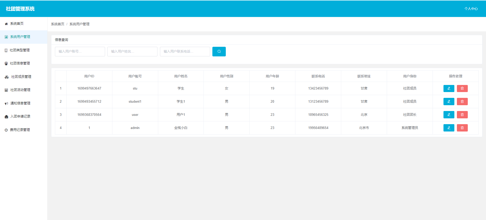
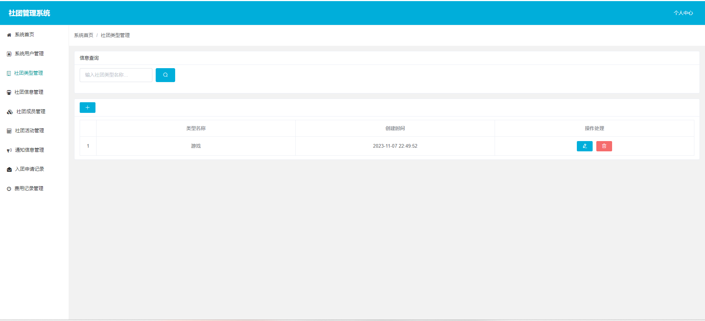
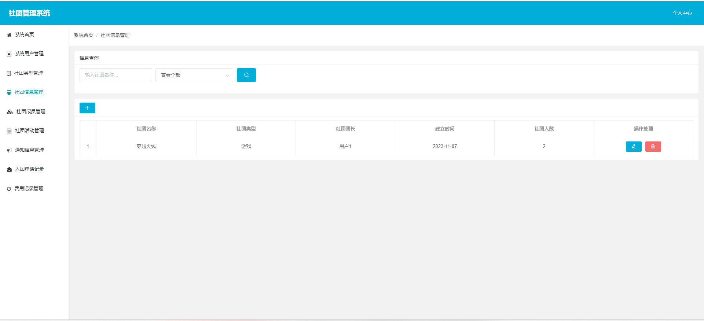
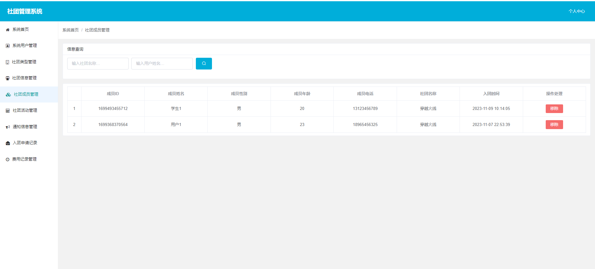

# 🎂

基于SpringBoot+Vue的大学生社团管理系统

## 介绍🌞

> 一个普通的增删改查项目，校园社团管理

## 项目演示🌞

+ 登录


+ 系统用户页面




+ 社团类型管理



+ 社团信息管理



+ 社团成员页面



## 安装教程🌞

```
1. 运行环境准备mysql8 + java8 + node14.16.1 + redis

2. 配置maven路径，加载依赖

3. 运行sql文件，确保application.yml或config.properties的数据库名称和账号密码是数据库所在主机的账号密码
```


## 使用说明🌞

```
1. 登入

  
2. 运行流程

SpringBoot+Vue项目的部署详情可以查看这篇CSDN博客：http://t.csdnimg.cn/kpuxS

前后端不分离项目的部署流程可以查看这篇CSDN博客：http://t.csdnimg.cn/CslA5
```


## CSDN项目合集🌞

点击前往：http://t.csdnimg.cn/Q4u84


## 联系我🌞

**有偿获取完整源码或调试代码**

🐧：1902317191

we-chat：coding1902317191
